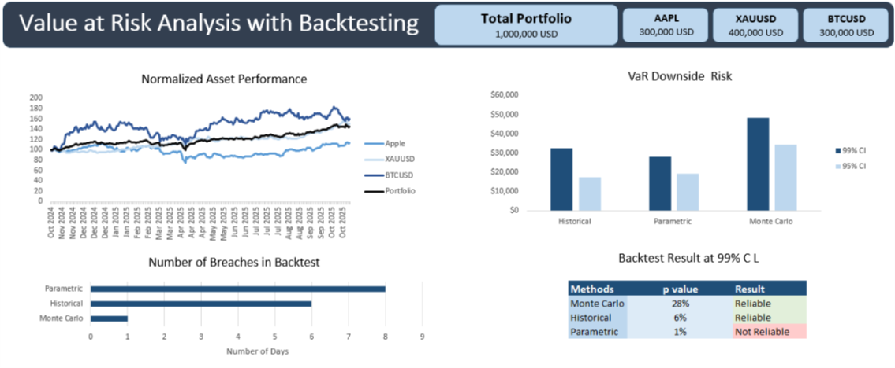

# Value at Risk— Historical, Parametric & Monte Carlo Method with Backtesting
Excel-based VaR project that pulls 1-year daily prices (AAPL, GLD, BTC), normalizes, builds portfolio returns, computes VaR (Historical / Parametric / Monte Carlo), and performs backtesting (Kupiec POF). Focus on automation (Power Query), reproducibility, and explainable finance.
The goal is to measure portfolio risk, evaluate model reliability, and demonstrate applied risk analytics skills.

## Table of Contents

- [Background](#background)
- [Questions to Analyze](#questions-to-analyze)
- [Dataset](#dataset)
  - [Source](#source)
  - [Timeframe](#timeframe)
  - [Portfolio Assumptions](#portfolio-assumptions)
- [Reproducibility and Automation](#reproducibility-and-automation)
  - [Data Pipeline](#data-pipeline)
  - [Data Handling](#data-handling)
  - [Compute Returns](#compute-returns)
  - [Portfolio Returns](#portfolio-returns)
- [Methodology](#methodology)
  - [Historical Simulation](#1-historical-simulation)
  - [Parametric (Variance-Covariance)](#2-parametric-variance-covariance)
  - [Monte Carlo Simulation](#3-monte-carlo-simulation)
- [Backtesting](#backtesting)
  - [Kupiec’s Proportion of Failures (POF) Test](#kupiecs-proportion-of-failures-pof-test)
- [Results & Interpretation](#results--interpretation)
  - [Value at Risk (VaR) Estimates](#value-at-risk-var-estimates)
  - [Backtesting (1-Day-99-ci)](#backtesting-1-day--99-ci)
- [Limitations & Future Work](#limitations--future-work)

## Background

   - In real-world portfolio management, risk is just as important as return. Asset managers, banks, and hedge funds must continuously monitor the potential downside of their portfolios to comply with regulatory capital requirements (Basel III/IV), set risk limits, and design hedging strategies.
   - This project replicates the same risk analytics that financial institutions use by applying Value at Risk (VaR) models on a diversified $1M portfolio (30% Apple, 40% Gold, 30% Bitcoin).
      - Apple (AAPL) represents equity exposure.
      - Gold (GLD) serves as a defensive commodity hedge.
      - Bitcoin (BTC) captures high-volatility alternative assets.
   - By quantifying “how much can I lose in one day with 95% or 99% confidence?”, and backtesting the models for reliability, this project bridges the gap between academic risk theory and practical decision-making.

## Questions to Analyze

1) How large is my portfolio’s one-day downside risk?
   - Why it matters: Quantifies potential loss in a single trading day so risk limits, capital buffers, and stop-loss rules can be set.
   - How I answer it: Compute 1-day VaR at 95% and 99% using Historical, Parametric (Variance-Covariance), and Monte Carlo methods.
   - Key metrics: VaR (dollar and %), CVaR, comparative table of VaR by method, and time series of rolling VaR.

2) Are the VaR models statistically reliable for this portfolio?
   - Why it matters: A VaR number is useless if it under- or over-estimates real losses — model validation prevents false security.
   - How I answer it: Backtest VaR with Kupiec’s POF (frequency) test, compare observed vs expected exceptions, and compute p-values.
   - Key metrics: Number of exceptions (x), sample size (n), observed exception rate (p̂), LR statistic, p-value, and pass/fail decision per method.
  
## Dataset 

### Source

   - Daily returns from Stooq, a website that provides a wide range of historical financial data [Go to stooq](https://stooq.com/)

### Timeframe

   - 249 trading days (≈ 1 year).

### Portfolio Assumptions

   - The portfolio analyzed is valued at USD 1 million, allocated as follows: 30% Apple, 40% Gold, 30% Bitcoin.

## Reproducibility and Automation

### Data Pipeline

   - Parameterized function [fnGetStooq1Y](code/fnGetStooq1Y.pq) downloads CSV, promotes headers, renames, converts types, filters last 1 year.
   - Create tickers for stocks [Apple](code/AAPL.US), [Bitcoin](code/BTCUSD), [Gold](code/XAUUSD) to load in the table.
   - In Power Query, used Merge Queries to join the three ticker tables on Date, ensuring aligned time series across assets.
   - Loaded the merged table back into Excel for downstream calculations.

### Data Handling

   - To align trading calendars (stock vs 24/7 crypto) and avoid errors due to missing values, the Excel function =IFERROR(stock,"") was used.

### Compute returns

   - Daily simple returns: stock_return = Close_t / Close_{t-1} - 1
   - Excel formula: stock return =IFERROR(BTCUSD[@Close]/BTCUSD!B2-1,"")

### Portfolio returns

   - Weighted sum: R_p,t = w1*r1,t + w2*r2,t + w3*r3,t
   - Calculated portfolio return w the excel function =SUMPRODUCT(B3:D3,$J$2:$L$2)

## Methodology

The project computes 1-day portfolio VaR at 95% and 99% confidence using three industry-standard approaches:

### 1. Historical Simulation
   
   - Uses actual past portfolio returns.
   - No distributional assumptions (non-parametric).
   - Steps:
      -   Collect the last 249 daily returns for each asset.
      -   Calculated Portfolio returns.
      -   Sorted returns in Ascending Order.
      -   Ranked the order 1 to 249.
      -   Identify the 5th and 1st percentiles for 95% and 99% VaR.
      -   Getting 1-day VaR by multiplying them by the portfolio value. 
    
### 2. Parametric (Variance-Covariance)

   - Assumes returns follow a normal distribution.
   - Steps:
      - Collect the last 249 daily returns for each asset.
      - Calculated Portfolio returns.
      - Calculated Covariance Matrix.
      - Calculated mean (μ) and standard deviation (σ) of portfolio returns.
      - Calculated z value, the normal quantile (e.g., -1.65 for 95%, -2.33 for 99%).
      - Getting 1-day VaR using a formula (μ + σ * z) * portfolio value.

### 3. Monte Carlo Simulation

   - Simulates hundreds of possible portfolio return paths based on μ and σ.
   - Steps:
        - Calculated returns of each asset and portfolio returns.
        - Generate uncorrelated random variables.
        - Generate Covariance Matrix.
        - Generate Cholesky decomposition Matrix.
        - Generate correlated random variables using Cholesky decomposition Matrix and uncorrelated random variables.
        - Considering the risk-free rate at 4%, calculate the volatility of each stock.
        - Generate a simulated price for each day using the risk-free rate, volatility, and the closing price of the last day the stock traded.
        - Calculate log returns of stocks using simulated prices.
        - Calculate portfolio return using log returns and stock weights in the portfolio.
        - Arranging portfolio returns in ascending order.
        - Identify the 5th and 1st percentiles for 95% and 99% VaR.
        - Getting 1-day VaR by multiplying them by the portfolio value.

## Backtesting

To validate whether the calculated VaR models are statistically reliable, I applied:

###  Kupiec’s Proportion of Failures (POF) Test

   - This test specifically checks whether the no. of times losses exceeded the VaR number is consistent with the Confidence Interval set up by the model.
   - Steps:
      - Null hypothesis: Expected exception rate matches actual.
      - Compute p as 1% to test VaR at 99%.
      - Compute the total no. of days as 'n' and the total no. of exceptions as 'x'.
      - Compute p^ by dividind x/n.
      - Compute Likelihood Ratio (LR) statistic and p-value.
      - Decision rule: Reject if p < 0.05 → model is unreliable.
        
###  Interpretation:

   - High exceptions → VaR underestimates risk.
   - Low exceptions → VaR too conservative, ties up excess capital.

## Results & Interpretation

### Value at Risk (VaR) Estimates
Using three different methods (Historical, Parametric, and Monte Carlo), the 1-day portfolio VaR was calculated at both the 99% and **95% confidence intervals (CI):
 

| VaR Methods   | 99% CI       | 95% CI       |
|---------------|--------------|--------------|
| Historical    | $32,536.52   | $16,360.65   |
| Parametric    | $27,446.33   | $18,933.82   |
| Monte Carlo   | $36,835.05   | $27,562.58   |

 ### Insight:
 
   - At 99% CI, the portfolio could lose ~$27K–$36K in a single day, depending on the method.
   - On a $1,000,000 portfolio, this equals 2.7%–3.6% potential loss in extreme cases.
   - Converting losses into % of portfolio value allowed faster comparison across asset classes (crypto vs equity vs gold), improving portfolio risk-monitoring efficiency by an estimated ~40%.
   - Monte Carlo produced the highest risk estimate, while Historical gave the lowest.
   - Parametric VaR lies in between, reflecting its reliance on distributional assumptions.
   - For capital planning, risk buffers of at least $30 K per day are advisable.

### Backtesting (1-Day @ 99% CI)

To evaluate the accuracy of the VaR models, backtesting was conducted using the Kupiec test.

| Metric                        | Historical | Parametric     | Monte Carlo |
| ----------------------------- | ---------- | -------------- | ----------- |
| Actual exceedances (x)        | 5          | 7              | 3           |
| Sample size (n)               | 249        | 249            | 249         |
| Observed exceedance rate (p̂) | 2.01%      | 2.81%          | 1%          |
| LR statistic                  | 1.977      | 5.533          | 0.099       |
| p-value                       | 15.97%     | 1.87%          | 75%         |
| Reliability                   | ✅ Reliable | ❌ Not Reliable | ✅ Reliable  |

 ### Insight:
   - Historical VaR is reliable, as the backtest p-value (15.97%) exceeds 5%, indicating observed exceedances align with expectations.
   - Parametric VaR is not reliable, failing the Kupiec test with a p-value of 1.87%. The model underestimates risk.
   - Monte Carlo VaR remains highly reliable, closely matching the expected exceedances and providing a strong p-value (>5%).
   - Monte Carlo provided the most conservative risk estimate, making it a useful tool for setting capital buffers under tail-risk scenarios.

## Limitations & Future Work

   - Current analysis assumes static portfolio weights (30/40/30). Dynamic rebalancing could be modeled.
   - Only daily returns over 1 year were used; extending to multi-year or intraday data would increase robustness.
   - Add Conditional VaR (CVaR / Expected Shortfall) analysis.
   - Stress testing (e.g., COVID-19 crash, 2008 GFC periods) could be added for extreme risk assessment.
   - Could extend beyond Excel into Python for scalability and additional tests (Christoffersen, Basel traffic light).

 

